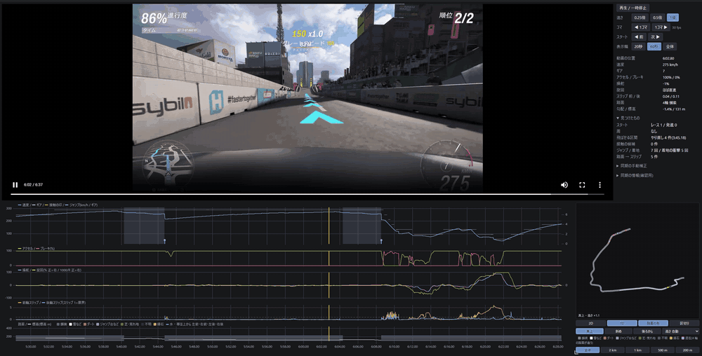

# HEISO(並走)単走版

> **English:** HEISO Solo records racing-game telemetry together with an OBS Studio recording, and plays back a run with the video and graphs side by side (currently Forza Horizon 6 on PC).
> The apps (`HeisoRecorder` and `HeisoPlayer`) support English. They follow the Windows display language by default; to choose it yourself, use Settings → Display → Language in the Player, and `Language` in `appsettings.json` for the Recorder.
> English manuals are in preparation. For now, the documentation below and the manuals are in Japanese.

レースゲームのテレメトリーと録画を同時に記録し、1 本の走りを**動画とグラフを並べて**振り返る Windows アプリです。
今の対応ゲームは Forza Horizon 6(PC 版)です。

- 記録アプリ(`HeisoRecorder`): ゲームから届くテレメトリー(Data Out)の記録と、OBS Studio の録画を、PC やスマホのブラウザから同時に開始・停止する
- 再生アプリ(`HeisoPlayer`): 録画を再生しながら、同じ瞬間の速度・ペダル・操舵・ギア・スリップ・路面などをグラフに、走った場所をコース図に示す



「単走版」は、自分の 1 本の走りを見るための版です。同じコースの 2 本の走りを並べて見比べる「並走」は、次の版から作ります。

## できること

**記録**
- テレメトリーの記録と OBS の録画を、ボタン 1 つで同時に始めて止める(スマホからも)
- 録画の画質を段階(最小〜高画質)で選ぶ。OBS のプロファイルを録画の間だけ切り替える
- 録画するシーンを選ぶ。OBS で別のシーンを選んだままでも、録画の間だけ切り替えてゲームを録画する
- 車の乗り換えとレースの開始・終了を自動で見つけ、車名・セッティング名・コース名を付ける

**再生**
- 動画の今の位置を、グラフのポインターとコース図の矢印で示す。グラフをクリックするとその瞬間へ飛ぶ
- 横軸を時間か距離で。リワインドでやり直した走りを除いて、最後まで走り切った 1 本として並べる
- スタート・接触・着地・ジャンプ・周回・路面から外れた所に印を付け、前後の印へ飛ぶ
- リワインド・チェックポイント逃しのやり直しと、フォトモード・メニューの一時停止を飛ばして再生する
- コース図は 2D と 3D(標高付き、後ろからの視点も)。路面の種類で色分けもできる
- スロー再生とコマ送り。映像とグラフが少しずれていたら、手で合わせて保存できる

**画面**
- 日本語と英語(Windows の表示言語に合わせるか、設定で選ぶ)
- 速度・距離・標高の単位を、km/h・m と mph・ft・mi から選ぶ

**共有**
- レースを 1 本選んで、動画・テレメトリー・情報をまとめた 1 つのファイル(`.heiso.zip`)に書き出す。受け取った人は再生アプリでそのまま開ける

## 動かすのに必要なもの

- Windows 11(x64)
- Forza Horizon 6(PC 版)
- OBS Studio 31 以降(32 で確かめています)
- .NET 10 のランタイム: ランタイム入りの zip なら要りません。ランタイムなしの zip では、.NET Desktop Runtime(再生アプリ)と ASP.NET Core Runtime(記録アプリ)。どちらも x64
- Microsoft Edge WebView2 ランタイム(Windows 11 には入っています)

## 入れ方と使い方

- 入れ方: [docs/install.md](docs/install.md)
- 使い方: [docs/usage.md](docs/usage.md)

ビルド済みの一式は、GitHub の Releases からダウンロードできます。ふつうは .NET のランタイム入りの `HEISO-<版>-win-x64.zip`(約 110MB、展開するだけで動く)を、.NET 10 を入れている人は軽い `HEISO-<版>-win-x64-light.zip`(約 2MB)を選んでください。

## ソースからビルドする

.NET 10 SDK(または Visual Studio 2026)で:

```
dotnet build csharp/HEISO.slnx
dotnet test csharp/HEISO.slnx
```

記録データ(`session.json`、`telemetry.csv.gz`)と配布パッケージの形式は [docs/session-format.md](docs/session-format.md) にあります。

## ライセンス

[MIT](LICENSE)。同梱している部品のライセンスは [THIRD-PARTY-NOTICES.md](THIRD-PARTY-NOTICES.md) にあります。

Forza Horizon は Microsoft Corporation の商標です。HEISO は Microsoft および Playground Games とは関係のない、非公式のツールです。
