# HEISO 単走版 のインストール

HEISO は、記録アプリ(`HeisoRecorder`)と再生アプリ(`HeisoPlayer`)の 2 つでできています。
このドキュメントの順にインストールと設定を行うと、ゲームのテレメトリーと OBS の録画を同時に記録し、再生アプリで見られるようになります。

使い方は [usage.md](usage.md) にあります。

## 1. 必要なもの

| ソフト・環境 | 備考 |
|---|---|
| Windows 11(x64) |  |
| Forza Horizon 6(PC 版) | テレメトリーのデータ出力(Data Out)を使います |
| OBS Studio 31 以降 | 録画に使います。32 で確かめています。WebSocket サーバー(obs-websocket)を使って OBS を操作します |
| .NET 10 のランタイム | ランタイム入りの zip なら不要です(下の「2.」) |
| Microsoft Edge WebView2 ランタイム | Windows 11 には最初から入っています |
| ffmpeg | 高解像度で録画した後、720p で書き出したい場合に使います(下の「8.」) |

再生アプリだけ使う(人からもらったパッケージを見るだけ)なら、OBS とゲームは不要です。

## 2. HEISO を置く

GitHub の Releases に、2 種類の zip があります。**通常は上のランタイム入り**を選んでください。

| zip | 大きさ | 中身 |
|---|---|---|
| `HEISO-<版>-win-x64.zip` | 約 125MB | .NET のランタイム入り。展開するだけで動きます |
| `HEISO-<版>-win-x64-light.zip` | 約 17MB | ランタイムなし。.NET 10 のランタイムを別に入れます(下の「3.」)。.NET 10 をすでに入れている人向け |

1. どちらかの zip をダウンロードする(`SHA256SUMS.txt` に、zip が壊れていないか確かめるための値があります)
2. 展開する前に、zip を右クリック →「プロパティ」→ 下の「許可する」にチェック →「OK」
   (インターネットから来たファイルの印を外します。外さないと、起動のたびに警告が出ることがあります)
3. 好きな場所に展開して、分かりやすい名前にする。例: `C:\HEISO`
   - `Program Files` の中は避けてください(設定のファイルを書き換えるのに管理者の権限が要ります)

展開すると、次のようになります。

```
C:\HEISO\
  HeisoRecorder\   記録アプリ(HeisoRecorder.exe)
  HeisoPlayer\     再生アプリ(HeisoPlayer.exe)
  docs\            このドキュメントと使い方
  README.md / LICENSE / THIRD-PARTY-NOTICES.md / CHANGELOG.md
```

初めて起動するとき、「Windows によって PC が保護されました」と出ることがあります(署名の無いアプリのため)。
「詳細情報」→「実行」で起動できます。

## 3. .NET 10 のランタイムを入れる(ランタイムなしの zip を選んだときだけ)

Microsoft の .NET 10 のダウンロードのページ(https://dotnet.microsoft.com/download/dotnet/10.0)から、次の 2 つを入れます。どちらも「Windows」の「x64」のインストーラーを選びます。

| ランタイム | 使うアプリ |
|---|---|
| .NET Desktop Runtime 10 | 再生アプリ |
| ASP.NET Core Runtime 10 | 記録アプリ |

- 再生アプリだけ使うなら、Desktop Runtime だけで動きます
- 入れ忘れていても、アプリを起動すると Windows が「.NET が必要です」と案内し、ダウンロードの場所を教えてくれます
- ランタイム入りの zip は、.NET の修正を HEISO の新しい版として配ります。ランタイムなしの zip なら、.NET の修正は Microsoft Update で届きます

## 4. OBS の準備

### OBS を入れる

OBS Studio の公式サイト(https://obsproject.com/ja/download)で Windows を選び、「ダウンロード インストーラ」から入れます。

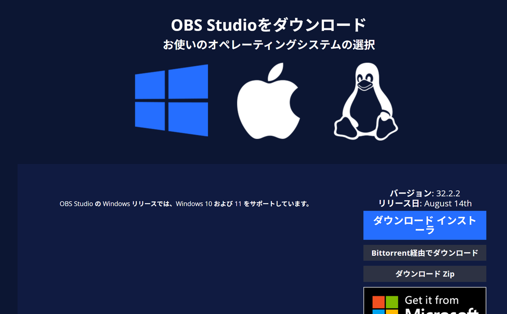

インストールが終わったら「Launch OBS Studio」にチェックを入れたまま「Finish」を押すと、OBS が起動します。

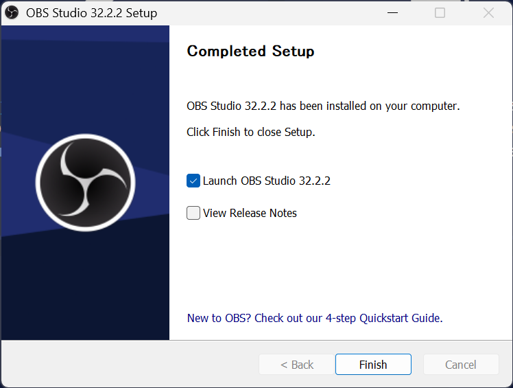

### 自動構成ウィザード

初めて起動すると自動構成ウィザードが出ます(後から「ツール」→「自動構成ウィザード」でも出せます)。

1. 使用情報は「**録画のために最適化し、配信はしない**」
   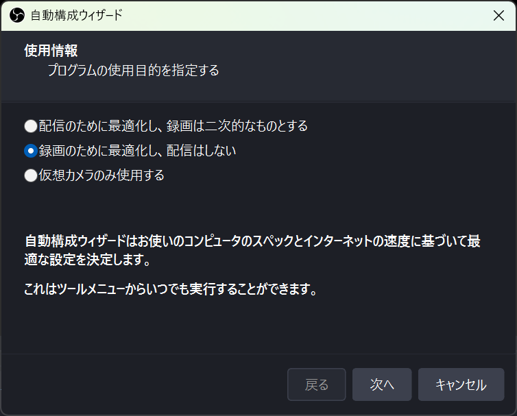
2. 映像設定はそのまま(基本解像度は今の画面、FPS は「60 または 30 のいずれか、可能なら 60 を優先」)
   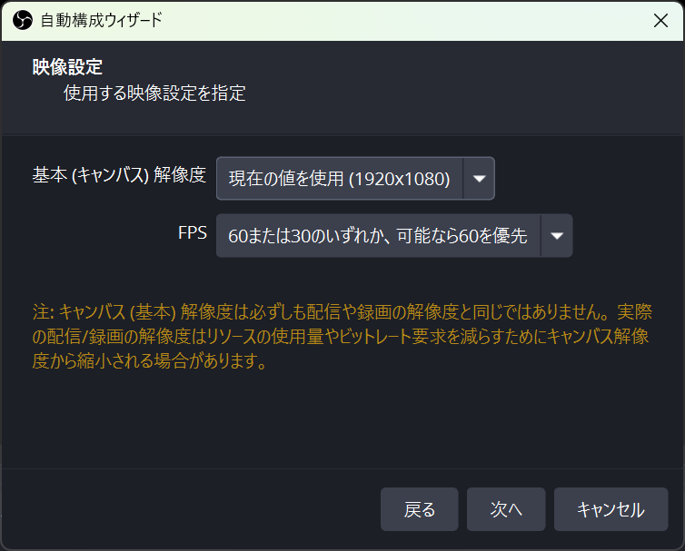
3. 最終結果で「設定を適用」。GPU のエンコーダ(NVIDIA なら「ハードウェア(NVENC, H.264)」、AMD なら AMF、Intel なら QSV)が選ばれていれば、ゲーム中でも録画の負担が小さくて済みます
   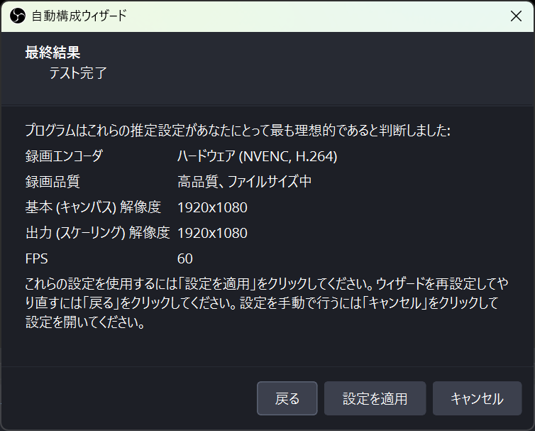

### HEISO 用のシーンを作る(ゲームキャプチャ)

HEISO で録画するための**シーンを 1 つ作り**、そこにゲームキャプチャを入れます。
記録アプリは、録画の間だけ OBS をこのシーンに自動で切り替え、録画が終わったら元のシーンに戻します(下の「HEISO 用のシーンへの自動の切り替え」)。

1. 下の「シーン」の「+」で、新しいシーンを作る。名前は分かりやすく、例えば `HEISO` にします
2. 作ったシーンを選び、「ソース」の「+」→「ゲームキャプチャ」を追加し、モードを「**フルスクリーンアプリケーションをキャプチャ**」にする
   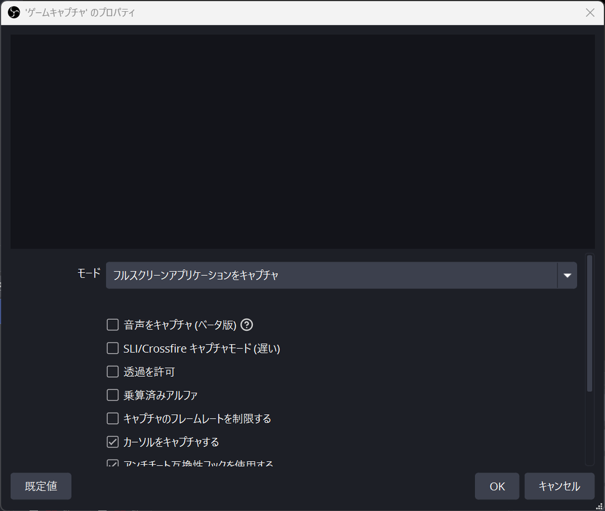
3. ゲームを起動すると、OBS のプレビューにゲームの画面が映ります
   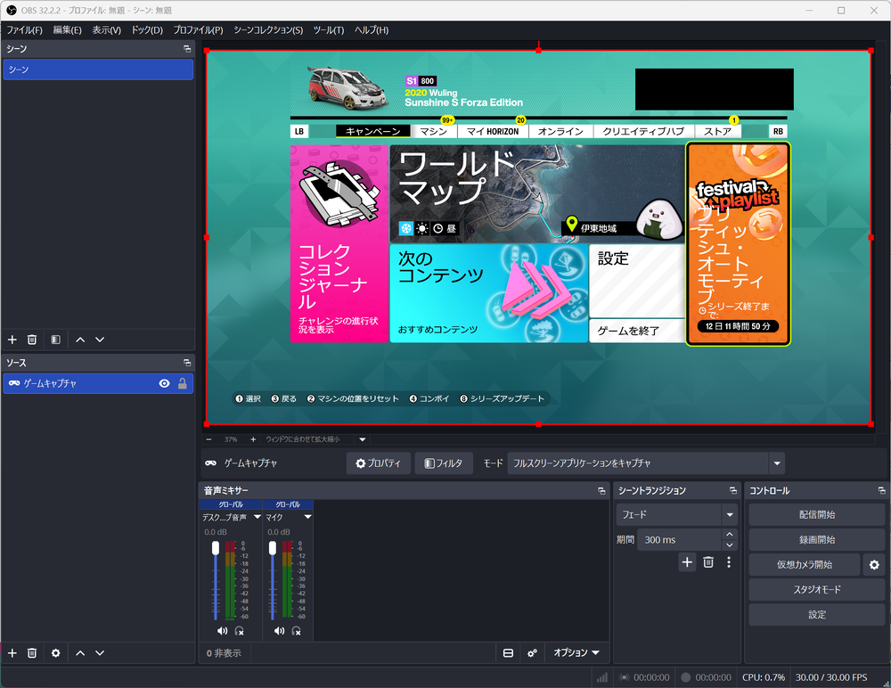

OBS を初めて使う人は、最初からある「シーン」にゲームキャプチャを入れてもかまいません。そのときは、そのシーンが HEISO 用のシーンになります。

### HEISO 用のシーンへの自動の切り替え(OBS を配信などに使っている人へ)

**記録アプリは、録画の間だけ、OBS を HEISO 用の状態に自動で切り替えます。録画が終わると、元の状態に戻します。**
切り替えるのは次の 2 つです。

| 切り替えるもの | 何が変わるか | 記録アプリで選ぶ所 |
|---|---|---|
| シーン | 何を映すか(HEISO 用のシーン = ゲームキャプチャ) | 「録画するシーン」 |
| プロファイル | どの画質で録るか(解像度・fps・容量。下の「HEISO ○○」) | 「録画の画質」 |

- 配信などで OBS をすでに使っている人は、**普段のシーンやプロファイルを HEISO 用に書き換える必要はありません**。HEISO 用のシーンを 1 つ足して、記録アプリの「録画するシーン」でそのシーンを選んでおくだけです
- OBS で普段のシーン(配信用の画面や、画面キャプチャ用のシーンなど)を選んだままでも、記録を始めれば HEISO 用のシーンで録画されます
- 記録アプリの「録画するシーン」が「OBS で今選んでいるシーン」のままだと、切り替えません。そのとき OBS で選んでいるシーンが、そのまま録画されます
- **配信しながら記録しないでください。** 録画の間は OBS のシーンが切り替わるので、配信の画面も HEISO 用のシーンに変わります
- 記録アプリが途中で落ちても、次に OBS へつながったときに元のシーンとプロファイルに戻します
- 選び方は [usage.md](usage.md) の「録画するシーン」にあります

### 映像と出力の設定

「設定」→「映像」: 基本(キャンバス)解像度は画面のまま、出力(スケーリング)解像度は 1920x1080、FPS は 30 が目安です(4K の画面なら 1080p に縮めて録ります)。

4K の画面なら、基本(キャンバス)解像度は画面と同じ 3840x2160 のまま、出力(スケーリング)解像度を 1920x1080 にします。基本(キャンバス)解像度は、使っている画面の解像度に合わせてください。

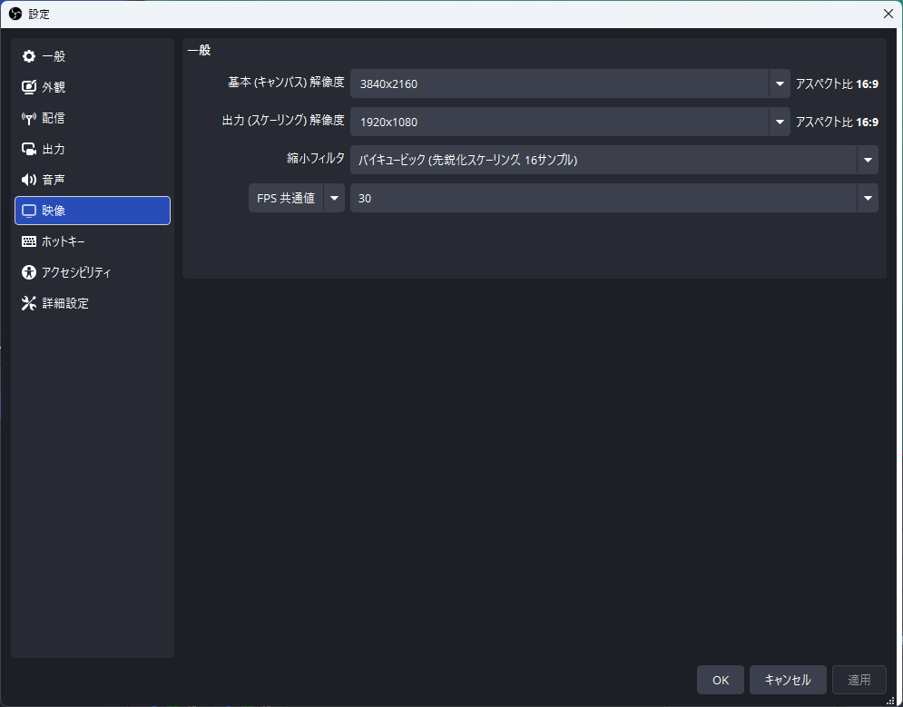

「設定」→「出力」: 出力モードは「**基本**」のまま、録画フォーマットを「**Hybrid MP4(.mp4)**」にします(録画中に落ちても壊れにくい形式です)。
録画ファイルのパスはどこでもかまいません。記録アプリが録画の間だけ、記録のフォルダに切り替えます。

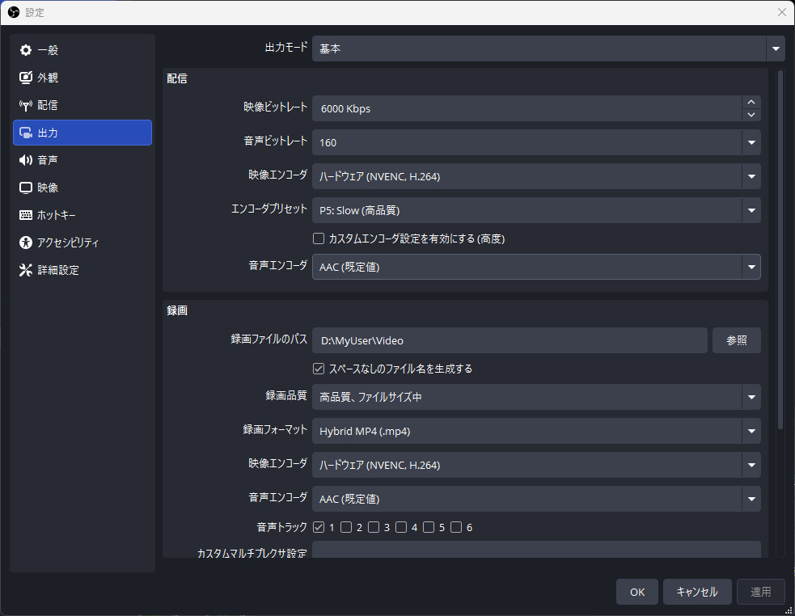

### WebSocket サーバーを有効にする

記録アプリは、OBS の WebSocket サーバーを通じて録画を始めたり止めたりします。

1. OBS の「ツール」→「WebSocket サーバー設定」
2. 「WebSocket サーバーを有効にする」をオン。サーバーポートは 4455 のまま
3. 「認証を有効にする」をオンにしたなら、**パスワードを控えておく**(「接続情報を表示」で見られます。下の「5.」で使います)

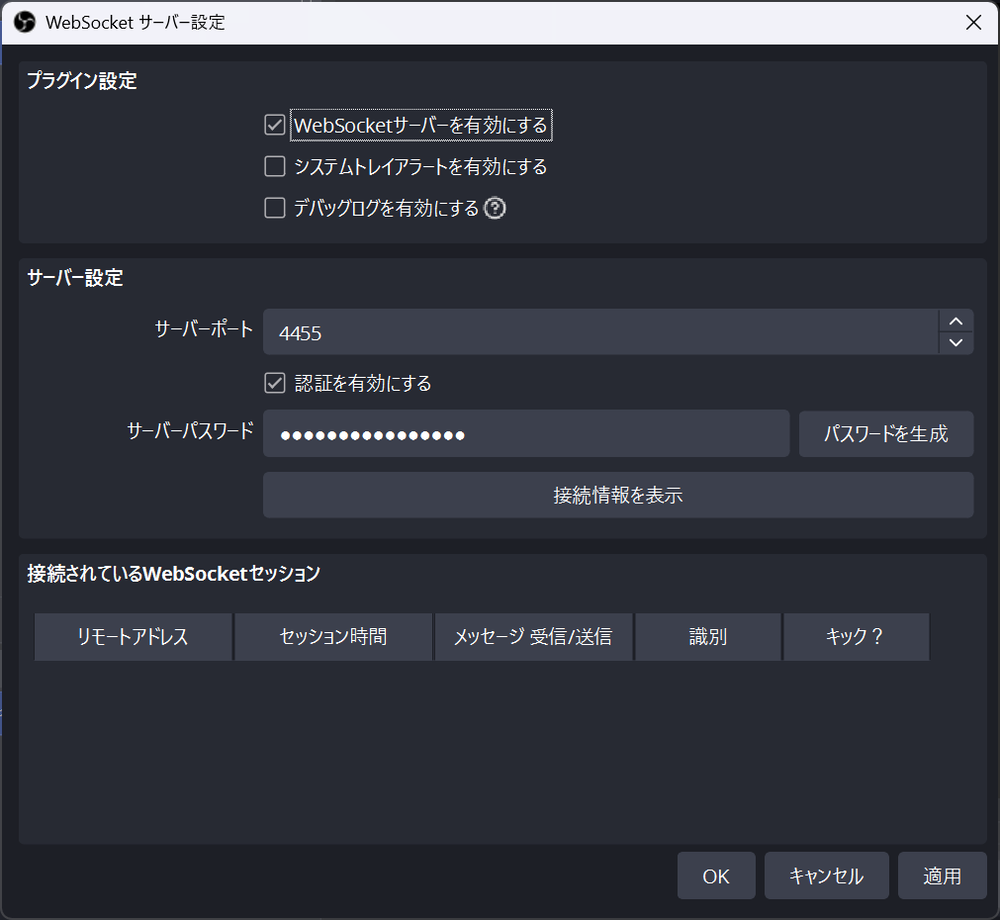

### 画質のプロファイルを作る(おすすめ)

記録アプリは、録画の画質を段階(最小・軽量・中間・標準・高画質)で選べます。段階ごとの OBS のプロファイル「HEISO ○○」を、次の手順で 1 回だけ作ります。

1. OBS の「設定」→「出力」の出力モードが「基本」であることを確かめる(「基本」の設定を元にして作ります)
2. **OBS を閉じる**(起動中に作ると、OBS が終わるときに上書きしてしまうため)
3. `HeisoRecorder` のフォルダを開き、アドレス欄に `cmd` と入れて Enter(そのフォルダでコマンドプロンプトが開きます)
4. 次を入れて Enter

```
HeisoRecorder --setup-obs-profiles
```

5. 「HEISO 最小: 作りました…」のような行が 5 つ出れば完了。OBS を起動すると、「プロファイル」のメニューに「HEISO ○○」が並びます

- 今の OBS のプロファイルを元にコピーして作ります。元のプロファイルは変えません
- HEISO のプロファイルは、録画のキーフレームを 1 秒にしています(配布用に動画を切り出すときに、頭をきれいに切るため)
- 作らなくても記録はできます(そのときは「OBS の設定のまま」で録画します)

確かめるなら、OBS の「プロファイル」で「HEISO 軽量」などを選び、「設定」→「出力」を開きます。出力モードが「詳細」になり、「録画」のタブのキーフレーム間隔が「1 s」になっていれば、正しくできています(確かめたら、プロファイルを元のものに戻してください)。

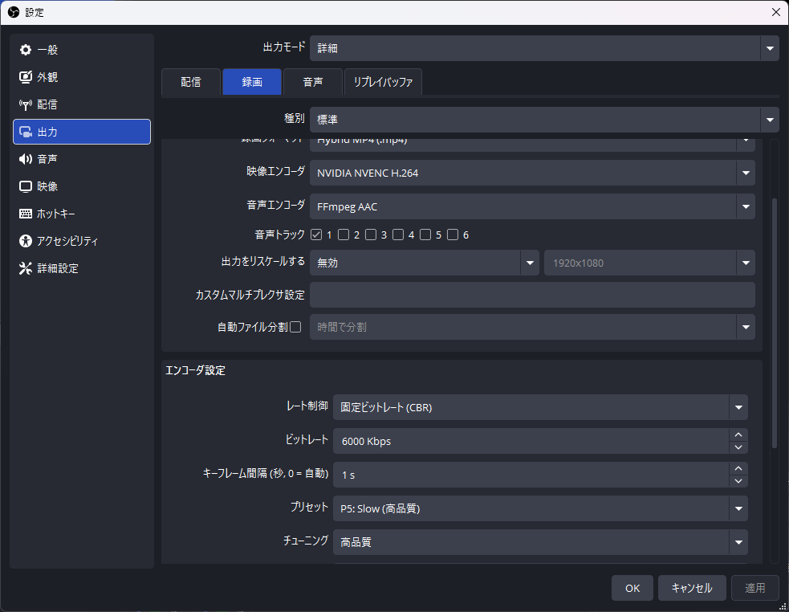

| 段階 | 解像度 / fps | 目安の容量 |
|---|---|---|
| 最小 | 540p / 30 | 約 19 MB/分 |
| 軽量 | 720p / 30 | 約 45 MB/分 |
| 中間 | 1080p / 30 | 約 75 MB/分 |
| 標準 | 1080p / 30(高画質) | 約 125 MB/分 |
| 高画質 | 1080p / 60 | 約 250 MB/分 |

### OBS だけで録画を試す

HEISO を使う前に、OBS だけでゲームを録画できるか確かめます。ここで録画できれば、HEISO から録画を始めたときも同じように録れます。

1. 「設定」→「ホットキー」で、「録画開始」と「録画終了」にキーを割り当てる(例: どちらも `Ctrl + F9`)。ゲームを全画面で遊んでいる間も、キーで録画を始めたり止めたりできます
   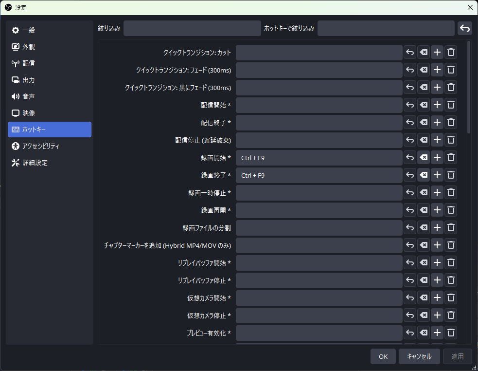
2. HEISO のプロファイルを作ったなら、OBS の「プロファイル」で使うもの(例: 「HEISO 軽量」)を選ぶ
3. OBS で HEISO 用のシーン(例: `HEISO`)を選んでゲームを起動し、OBS のプレビューにゲームが映っていることを確かめる
4. ゲームで少し走り、割り当てたキーで録画を始めて、30 秒ほどしたら止める
5. OBS の「ファイル」→「録画を表示」で録画のフォルダを開き、できた mp4 を再生する

- ゲームの画面が映っていて、動画がカクつかなければ準備は完了です。確かめたら、プロファイルとシーンを元のものに戻してください(HEISO で記録するときは、記録アプリが自動で切り替えます)
- 真っ黒なら、ゲームキャプチャのモードを確かめるか、ゲームを一度ウィンドウモードにしてから全画面に戻します
- 録画中にゲームが重くなるなら、画質の段階を下げるか、「設定」→「映像」の FPS を 30 にします

## 5. 記録アプリの設定(OBS のパスワード)

OBS の WebSocket で認証をオンにしている場合だけ必要です。

1. `HeisoRecorder` のフォルダの `appsettings.Local.example.json` をコピーし、名前を `appsettings.Local.json` にする
2. メモ帳で開き、`"Password"` の値を OBS の WebSocket のパスワードに書き換える
3. `"OutputDir"` は記録を保存するフォルダです。既定(「ビデオ\FH6Recorder」)でよければ、その行を消します。別の場所にするなら書き換えます(`\` は `\\` と 2 つ重ねて書きます)

```json
{
  "Recorder": {
    "UdpPort": 5400,
    "Obs": {
      "Password": "OBS の WebSocket のパスワード"
    }
  }
}
```

記録アプリの画面の言語と速度の単位も、ここで決められます(書かなければ自動)。

| 項目 | 値 |
|---|---|
| `Language` | `auto`(Windows の表示言語が日本語なら日本語、それ以外は英語)/ `ja` / `en` |
| `SpeedUnit` | `auto`(Windows の地域が米国か英国なら mph、それ以外は km/h)/ `kmh` / `mph` |

```json
{
  "Recorder": {
    "Language": "en",
    "SpeedUnit": "mph"
  }
}
```

再生アプリの言語と単位は、再生アプリの「設定」→「画面」で選びます。

## 6. ゲームの準備(Data Out)

Forza Horizon 6 の「設定」→「画面表示とゲームプレイ」の、いちばん下の「テレメトリ」で:

| 項目 | 値 |
|---|---|
| データ出力 | オン |
| データ出力 IP アドレス | `127.0.0.1` |
| データ出力 IP ポート | `5400` |

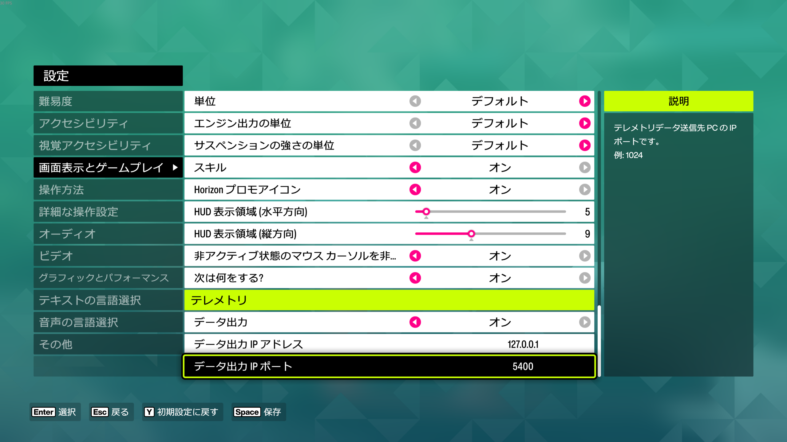

ポートを変えたいときは、`appsettings.Local.json` の `UdpPort` も同じ値にします。5200〜5300 はゲーム自身が使うので避けてください。

### SimHub などと一緒に使う(パススルー)

ゲームのデータ出力(Data Out)は 1 か所にしか送れません。SimHub などほかのテレメトリーのアプリも使うときは、ゲームのデータ出力を HEISO(5400)に向け、
HEISO が受けたデータをそのまま、そのアプリへ送り直します(記録していないときも送り続けます)。

1. SimHub の側で、Forza のデータを受けるポートを確かめる(今までゲームのデータ出力に入れていたポート。HEISO の 5400 とは別の番号にする)
2. `appsettings.Local.json` の `ForwardTo` に、`"ホスト:ポート"` で送り先を書く(複数書けます)

```json
{
  "Recorder": {
    "UdpPort": 5400,
    "ForwardTo": [ "127.0.0.1:8000" ]
  }
}
```

3. 記録アプリを起動すると、画面のテレメトリーの欄に「転送 127.0.0.1:8000」と出ます。SimHub にデータが届いているか確かめてください

- 送り先のアプリが動いていなくても、HEISO の記録には影響しません
- 自分自身(同じ PC の 5400)を送り先にすると、データがぐるぐる回るので使えません(画面に警告を出します)

## 7. 起動して確かめる

1. OBS を起動する
2. `HeisoRecorder\HeisoRecorder.exe` を起動する。黒い窓(記録アプリの本体)が開き、PC のブラウザに記録アプリの画面が出ます
   - 初回は Windows のファイアウォールの確認が出ます。「プライベート ネットワーク」を許可してください(スマホから画面を開くため)
3. ゲームを起動して走ると、画面に速度や車が出ます。「OBS 接続済み」と出ていれば準備は完了です
4. スマホで記録アプリを使うなら、画面の QR コードを、PC と同じ Wi-Fi につないだスマホで読みます
   - ESET などのセキュリティソフトを使っている場合は、スマホから開けないことがあります。セキュリティソフトのログでブロックされていないか確かめ、ブロックされていれば解除してください

記録アプリを終えるときは、黒い窓で **Ctrl+C** を押します(記録中なら、録画を止めてファイルを閉じてから終わります。窓の × で閉じると保存が間に合わないことがあります)。

再生アプリは `HeisoPlayer\HeisoPlayer.exe` を起動します。

## 8. 720p で書き出すなら(ffmpeg)

再生アプリの「書き出す」で、動画を 720p に縮めて(作り直して)パッケージにできます。ファイルが小さくなり、人に渡しやすくなります。
作り直しには **ffmpeg** を使います。HEISO には入っていないので、使うときだけ次の手順で入れてください(元の画質のまま書き出すだけなら不要です)。

1. ffmpeg の Windows 用のビルドを配っている gyan.dev のページ(https://www.gyan.dev/ffmpeg/builds/)の「release builds」から、`ffmpeg-release-essentials.zip` をダウンロードする
   - ffmpeg の公式サイト(https://ffmpeg.org/download.html)の Windows の案内からも、このページに行けます
   - インストールは不要です(展開するだけで使えるポータブル版です)
2. zip を右クリック →「プロパティ」→「許可する」にチェック →「OK」(「2.」と同じ)
3. HEISO のフォルダの中に `ffmpeg` という名前のフォルダを作り、そこに展開する

```
C:\HEISO\
  HeisoRecorder\
  HeisoPlayer\
  ffmpeg\
    ffmpeg-<版>-essentials_build\
      bin\ffmpeg.exe
```

4. 再生アプリの「設定」→「書き出し」で「確かめる」を押す。「見つけた ffmpeg: …」と、使えるエンコーダ(NVIDIA・AMD・Intel・CPU のうち、この PC で使えるもの)が出れば準備完了です

- 別の場所に展開したときは、「設定」→「書き出し」の「場所」に、そのフォルダ(または `ffmpeg.exe`)を指定します。PATH に入っている ffmpeg も見つけます
- GPU のエンコーダ(NVIDIA の NVENC、AMD の AMF、Intel の Quick Sync)が使えれば、4 分のレースが数十秒で終わります。どれも使えなければ CPU で作ります(数分かかります)
- ffmpeg のライセンス(essentials のビルドは GPL)は ffmpeg のものです。HEISO は ffmpeg を配布していません

## うまくいかないとき

| 症状 | 確かめること |
|---|---|
| 起動すると「.NET が必要です」と出る | ランタイムなしの zip を使っている。ランタイム入りの zip に替えるか、「3.」のランタイムを入れる。記録アプリは ASP.NET Core Runtime、再生アプリは Desktop Runtime。どちらも x64 |
| 記録アプリの画面に速度が出ない | ゲームのデータ出力がオンで、IP `127.0.0.1`、ポートが `UdpPort`(既定 5400)と同じか。ほかのテレメトリーのツールが同じポートを使っていないか |
| 「OBS 未接続」のまま | OBS が起動しているか。WebSocket サーバーが有効か。認証をオンにしているならパスワード(「5.」) |
| 録画にゲームが映っていない(別のシーンが録画された) | 記録アプリの「録画するシーン」で、HEISO 用のシーン(ゲームキャプチャのあるシーン)を選ぶ。「OBS で今選んでいるシーン」のままだと、OBS で選んでいるシーンが録画されます(「4.」の「HEISO 用のシーンへの自動の切り替え」) |
| 画質の選択肢に「OBS に未作成」と出る | 「4.」のプロファイルを作っていない。そのままでも「OBS の設定のまま」で録画できます |
| `--setup-obs-profiles` で「OBS が起動しています」 | OBS を完全に閉じてから(タスクトレイも)もう一度 |
| スマホから開けない | PC とスマホが同じ Wi-Fi か。ファイアウォールで「プライベート ネットワーク」を許可したか。セキュリティソフトがブロックしていないか。PC の画面の「PCのアドレス」で別の候補を選ぶ(仮想の LAN のアドレスが先に出ることがあります) |
| 再生がカクつく・動画が一瞬ずつ止まる・止まったまま動かない | ゲームを終了してから再生する。ゲームは画面の後ろに回っても GPU で描き続けるので、再生アプリの動画の表示と取り合いになります(2026-09-28 に確認。ゲームを閉じたら直った) |
| 書き出しの「720p に縮める」が選べない | ffmpeg が見つからないか、使えるエンコーダが無い。「8.」の手順で入れ、「設定」→「書き出し」の「確かめる」で状態を見る |
| 再生アプリが途中で落ちる | 次に起動したときに、ログの場所を知らせます(`%LOCALAPPDATA%\HEISO\Player\logs`)。GitHub の Issues にログを添えて知らせてもらえると助かります |

## 消すとき

- 展開したフォルダ(例: `C:\HEISO`)を消す
- 再生アプリの設定とログ: `%LOCALAPPDATA%\HEISO`
- 記録したデータ: 「ビデオ\FH6Recorder」(または `OutputDir` に書いたフォルダ)。いらなければ消します
- OBS のプロファイル「HEISO ○○」: OBS の「プロファイル」→「削除」で 1 つずつ
