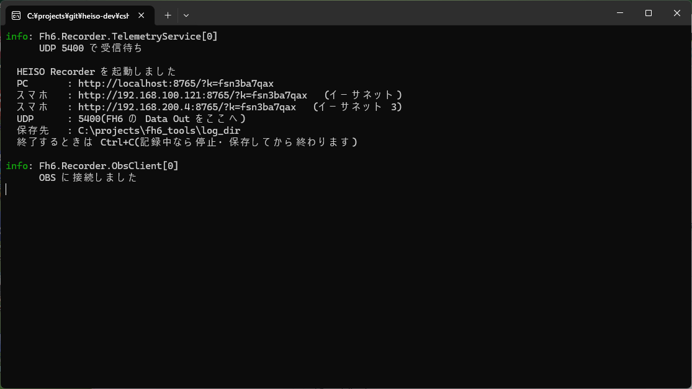
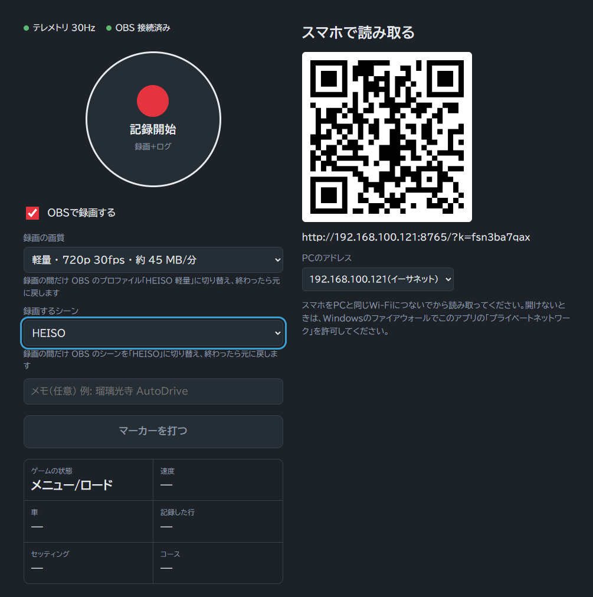
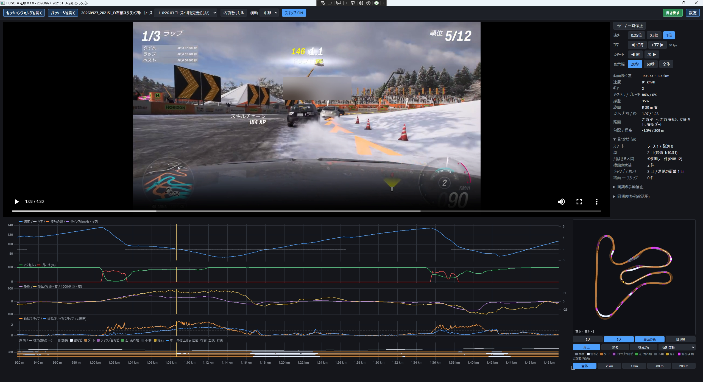
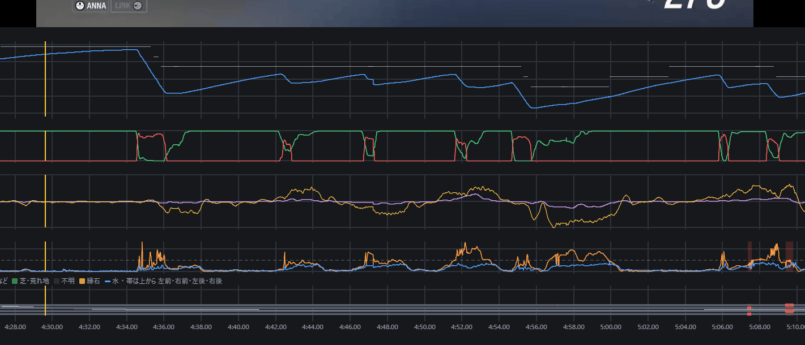
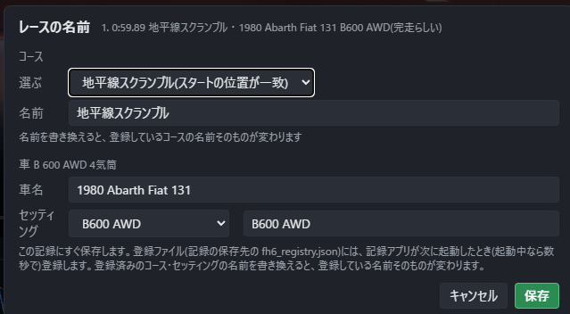
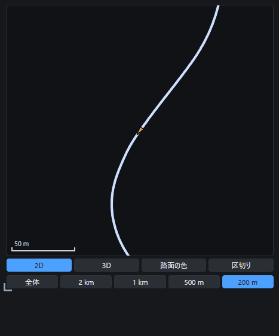
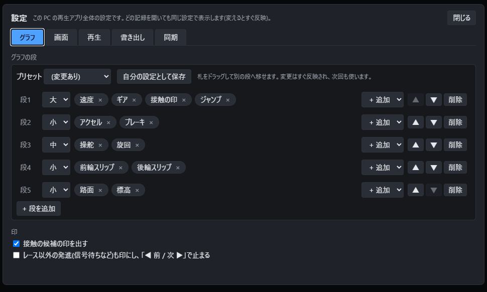
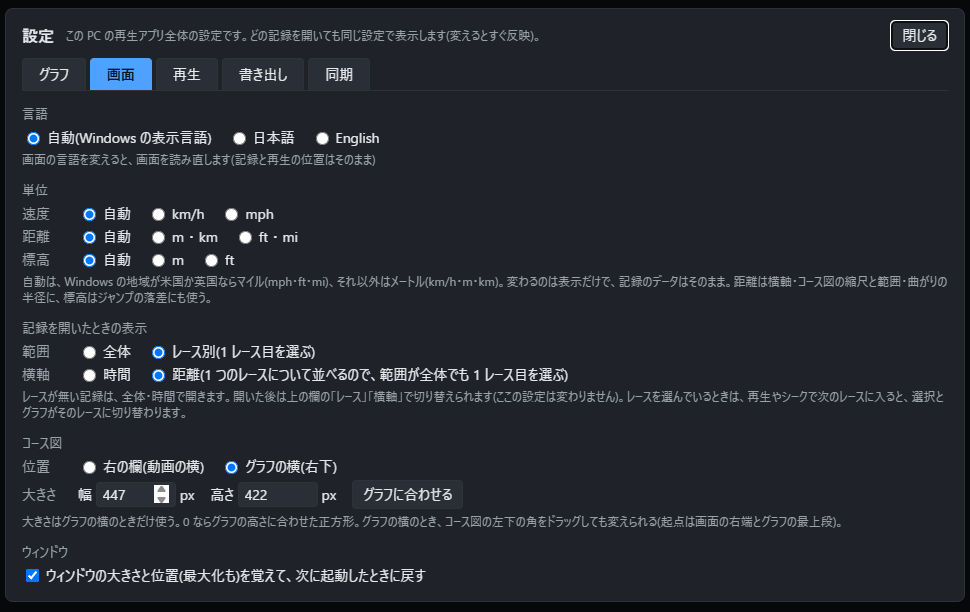
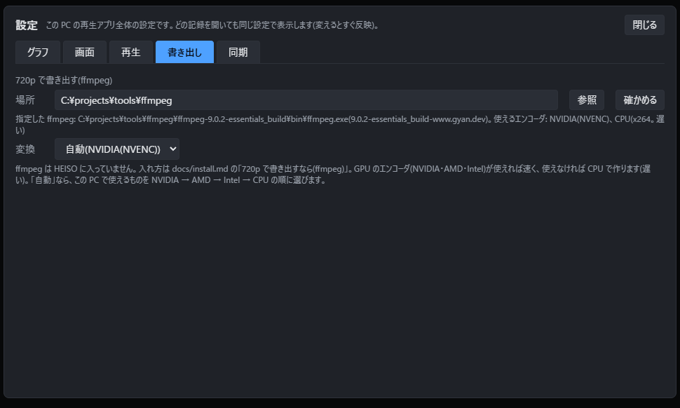

# HEISO 単走版 の使い方

インストールと設定は [install.md](install.md) にあります。

1. 記録アプリで、走りながらテレメトリーと録画を記録する
2. 再生アプリで、動画とグラフを並べて見る
3. 見せたいレースを 1 本、パッケージ(`.heiso.zip`)に書き出して人に渡す

## 1. 記録する(記録アプリ)

OBS を起動してから `HeisoRecorder.exe` を起動します。黒い窓(記録アプリの本体)が開き、PC のブラウザに記録アプリの画面が出ます。
黒い窓には、PC とスマホで開くアドレス、テレメトリーを受けるポート、保存先が出ます。OBS につながると「OBS に接続しました」と出ます。

スマホで使うなら、PC の画面の QR コードを読みます(PC と同じ Wi-Fi で)。スマホの画面は、ブックマークしておけば次からもそのまま開けます。

### 記録の始め方と止め方

1. 「OBSで録画する」がオンで、「録画の画質」と「録画するシーン」を選ぶ(録画しないでテレメトリーだけ記録するなら、オフにする)
2. 必要ならメモを入れる(例: `メカ・マイ・デイ`)。記録のフォルダ名の後ろに付きます
3. 丸いボタンで記録を始める。画面のふちが**赤**なら録画とテレメトリー、**青**ならテレメトリーだけ
4. 走る。記録を止めずに、何本続けて走ってもかまいません(再生アプリがレースを 1 本ずつ見分けます)
5. 止めるときは丸いボタンを押し、3 秒以内にもう一度押す(うっかり止めないように 2 回押します)

- 「マーカーを打つ」で、その時刻に印を付けられます
- 録画の画質は、段階が小さいほどファイルが小さくなります。人にパッケージを渡すつもりなら「軽量」か「中間」がおすすめです(4 分のレースで 200〜300MB くらい)。高い画質で録って、書き出すときに ffmpeg で 720p に縮めることもできます(「軽量」と同じ 720p になります)
- 記録は「ビデオ\FH6Recorder」(または設定した保存先)に、`20260928_153147` のような日時のフォルダで作られます。後からどのレースか分かりやすくしたいときは、フォルダ名の後ろに手でコメントを足してもかまいません(例: `20260928_153147#夏_鳥野山`)

### 録画するシーン(OBS の自動の切り替え)

**記録アプリは、録画の間だけ OBS を HEISO 用のシーンとプロファイルに切り替え、録画が終わったら元に戻します。**
配信などで OBS をすでに使っている人も、普段のシーンやプロファイルはそのままで、HEISO 用のシーンを 1 つ足すだけで使えます(作り方は [install.md](install.md) の「HEISO 用のシーンを作る」)。

1. OBS に、ゲームキャプチャを入れた HEISO 用のシーン(例: `HEISO`)を作っておく
2. 記録アプリの「**録画するシーン**」で、そのシーンを選ぶ。説明に「録画の間だけ OBS のシーンを「HEISO」に切り替え、終わったら元に戻します」と出ます
3. あとは普段どおり記録を始めて止めるだけです。OBS で別のシーンを選んでいても、録画の間は HEISO 用のシーンに切り替わり、止めると元のシーンに戻ります

| 「録画するシーン」 | 録画されるもの |
|---|---|
| HEISO 用のシーン(例: `HEISO`) | いつも HEISO 用のシーン。OBS で何を選んでいても切り替える(**おすすめ**) |
| OBS で今選んでいるシーン | 記録を始めたときに OBS で選んでいるシーン。切り替えない |

- 選んだシーンは次の起動でも使います。「録画の画質」(OBS のプロファイル)も同じように、録画の間だけ切り替えて元に戻します
- 選んだシーンが OBS に無い(名前を変えた・消した)ときは、切り替えずに今のシーンで録画し、画面に知らせます
- **配信しながら記録しないでください。** 録画の間は OBS のシーンが切り替わるので、配信の画面も変わります

### 車とコースの名前

テレメトリーには車やコースの名前が入っていないので、記録アプリで名前を付けます。記録していないときも、ゲームの様子を見ています。

- **車の確認**: 乗り換えると出ます。初めての車なら車名を入れます。同じ車でもセッティングで PI などが変われば、セッティング名を付けられます。一度登録した組み合わせは、次から自動で名前が出ます
- **コースの確認**: 初めてのコースでレースが始まると出ます。レース名と種類を入れます。次からはスタートの位置で自動で見分けます
- 「あとで」で閉じてもかまいません。「直前のレース」の「コース名・車名を直す」で、レースの後や記録を止めた後でも付けられます。付けた名前は、再生アプリのレースの一覧に出ます
- 再生アプリの「名前を付ける」でも、車とコースの名前を付けられます(下の「レースを選ぶ」)

### 終わるとき

記録アプリの黒い窓で **Ctrl+C** を押します。

## 2. 見る(再生アプリ)

`HeisoPlayer.exe` を起動し、「セッションフォルダを開く」で記録のフォルダ(`20260928_153147` など)を選びます。

**再生がカクつく場合は、ゲームを終了してください。** ゲームは画面の後ろに回っても GPU で描き続けるので、動画が一瞬ずつ止まったり、止まったままになったりします。

### 画面

- 上: 動画。右に操作とコース図、ポインターの位置の値、見つけたもの
- 下: グラフ。横軸は動画の位置。**黄色の縦線**が今の位置です
- グラフの印: 水色の ▼ がスタート、白い ◇ が周回のスタート(塗りはゴール)、橙の点線が接触、紫の帯がジャンプ、赤がコースを外れてスリップやリワインドにつながった所、灰色の帯がスキップできる区間

再生すると、黄色の縦線が動画に合わせて進みます。

### よく使う操作

| 操作 | 動き |
|---|---|
| Space | 再生・一時停止 |
| グラフや動画の上でホイール | 1 秒ずつ前後に(Shift を押しながらなら 1 コマ) |
| `,` / `.` | 1 コマ戻る・進む |
| Ctrl+← / → | 10 秒前後に(Ctrl+Alt なら 30 秒) |
| グラフをクリック | その瞬間へ |
| Ctrl+ホイール(グラフの上) | グラフの横の拡大・縮小 |
| 「◀ 前」「次 ▶」 | 前後の印(スタートの 3 秒前、周回の 1 秒前など)へ |
| 速さ | 0.25 / 0.5 / 1 倍 |
| コース図をクリック | その場所を通った瞬間へ |

### レースを選ぶ

上の「レース」で、記録の中のレースを選べます(コース名・車名と、完走したか中断したかの推定が出ます)。
選ぶとスタートの 3 秒前へ移り、グラフをそのレースの範囲にします。

- **「名前を付ける」**で、そのレースのコース名・車名・セッティング名を付けられます。記録アプリで付け忘れたときに。付けた名前は、次に記録アプリを起動したときに登録され、次からは自動で出ます

  

- **横軸を「距離」にする**と、スタートからの距離でグラフを並べます。リワインドでやり直した走りは除いて、最後まで走り切った 1 本として並べます
- **「スキップ ON」**にすると、再生中にリワインドやチェックポイント逃しのやり直しと、フォトモード・メニューの一時停止を飛ばします

### コース図

- 「2D / 3D」で切り替え。3D は標高付きで、「真上 / 斜め / 後ろから」の視点。マウスで回したり(左ドラッグ)、動かしたり(右ドラッグ)、拡大(ホイール)できます
- 「全体 / 2km / 1km / 500m / 200m」で拡大すると、今の位置に付いていきます。「区切り」にすると、直線の真ん中で区切った区間ごとに視点を移します(スピンしても図が回りません)
- 「路面の色」で、走った所を路面の種類(舗装・ダート・芝など)で塗り分けます

### 設定

右上の「設定」で、次のことを変えられます。どの記録を開いても同じ設定で表示します(変えるとすぐ反映)。各項目の説明は、設定の画面にも出ています。

| タブ | できること |
|---|---|
| グラフ | グラフの段の組み合わせ(速度・ペダル・操舵・スリップ・路面・標高など)。プリセットから選ぶか、札をドラッグして並べ替え、自分の設定として保存。接触や発進の印を出すか |
| 画面 | 画面の言語(日本語・English)、単位(km/h・mph、m・ft など)、記録を開いたときの表示(全体かレース別か、時間か距離か)、コース図の置き場所と大きさ、ウィンドウの大きさを覚えるか |
| 再生 | 開いたら最初のレースのスタート 3 秒前から再生する、やり直しと一時停止の区間を自動で飛ばす |
| 書き出し | 720p で書き出すときの ffmpeg の場所とエンコーダ([install.md](install.md) の「8.」) |
| 同期 | 映像とグラフを合わせる方式(確認用。通常は変えません) |

#### グラフ

**グラフの段**: 下のグラフを何段に分け、どの段に何を描くかを決めます。

| 項目 | 説明 |
|---|---|
| プリセット | 決まった組み合わせから選びます。「3段」(初めはこれ)・「2段」・「4段(今までの形)」・「詳細」(速度とギア・ペダル・操舵と旋回・スリップ・路面・標高の 6 段)。「自分の設定」は、保存した組み合わせです |
| 自分の設定として保存 | 今の組み合わせを「自分の設定」として覚えます。プリセットを選び直しても、いつでも戻せます |
| 段の高さ | 各段の左の「大 / 中 / 小」で、段の高さを変えます |
| 札(速度・ギアなど) | 段に描くものです。札をドラッグすると別の段へ移せます。× で外し、「+ 追加」で足します |
| ▲ ▼ / 削除 / + 段を追加 | 段の並べ替え、段を消す、段を足す |

描けるもの: 速度、ギア、アクセル、ブレーキ、操舵、旋回、前輪スリップ、後輪スリップ、勾配、標高、路面(4 輪の帯)、接触の印、ジャンプ。
1 つの段の 1 つ目の単位は左、2 つ目の単位は右に目盛りが付きます。変更はすぐグラフに反映され、次に開いたときも使います。

**印**

| 項目 | 説明 |
|---|---|
| 接触の候補の印を出す | 壁や車に当たったらしい所に、橙の点線の印を出します。印が多すぎて邪魔なときはオフに |
| レース以外の発進も印にする | 信号待ちなど、レース以外の発進にも印を付け、「◀ 前 / 次 ▶」で止まるようにします。フリーロームの練習を見返すときに |

#### 画面

| 項目 | 説明 |
|---|---|
| 言語 | 「自動」は Windows の表示言語が日本語なら日本語、それ以外は英語。日本語・English に固定もできます。変えると画面を読み直します(開いている記録と再生の位置はそのまま) |
| 単位 | 速度(km/h・mph)、距離(m・km / ft・mi)、標高(m / ft)を別々に選びます。「自動」は Windows の地域が米国か英国ならマイル、それ以外はメートル。変わるのは表示だけで、記録のデータは変わりません |
| 記録を開いたときの表示 | 記録を開いたときに、全体を出すかレース別(1 レース目を選ぶ)か、横軸を時間にするか距離にするか。開いた後は、上の欄の「レース」「横軸」でいつでも切り替えられます |
| コース図 | 置く場所を「右の欄(動画の横)」か「グラフの横(右下)」から選びます。グラフの横のときは大きさ(幅・高さ)も決められます。0 ならグラフの高さに合わせた正方形。コース図の左下の角をドラッグしても変えられます |
| ウィンドウ | ウィンドウの大きさと位置(最大化も)を覚えて、次に起動したときに戻します |

#### 再生

| 項目 | 説明 |
|---|---|
| 最初のレースのスタートの 3 秒前から再生する | 記録を開いたら、すぐにレースの直前から再生を始めます |
| やり直し区間と一時停止を自動で飛ばす | 記録を開いたときに、上の欄の「スキップ」を ON にしておきます。リワインド・チェックポイント逃しのやり直しと、フォトモード・メニューの一時停止(グラフの灰色の帯)を飛ばして再生します |

#### 書き出し

| 項目 | 説明 |
|---|---|
| 場所 | ffmpeg の場所。空なら自動で探します(PATH と、HEISO のフォルダの中の `ffmpeg` フォルダ)。「参照」で選び、「確かめる」で、見つかった ffmpeg と使えるエンコーダが出ます |
| 変換 | 720p に縮めるときのエンコーダ。「自動」なら、この PC で使えるものを NVIDIA → AMD → Intel → CPU の順に選びます。CPU は遅いので、GPU が使えるならそちら |

ffmpeg の入れ方は [install.md](install.md) の「8.」にあります。元の画質のまま書き出すだけなら、ここの設定は不要です。

#### 同期

映像とグラフを合わせる方式です。確認用なので、**通常は「録画開始イベント」のまま変えないでください**。
映像とグラフがずれて見えるときは、ここではなく、右の欄の「同期の手動補正」で合わせます(下の「映像とグラフがずれていたら」)。

### 映像とグラフがずれていたら

通常はずれませんが、少しずれて見えるときは、右の欄の「同期の手動補正」で合わせられます。

1. 着地の衝撃やスタートの瞬間などのコマで止め、「このコマを使う」
2. 「グラフで指す」を押し、グラフで同じ瞬間をクリック
3. 「保存」。次に開いたときも合わせたままになります

## 3. 人に渡す(配布パッケージ)

### 書き出す

1. 再生アプリで記録を開き、上の「レース」で書き出すレースを選ぶ
2. 右上の緑の「書き出す」を押し、書き出し方を選ぶ
   - **元の画質のまま**: 作り直さずに切り出します。画質は録ったときのままで、数秒で終わります
   - **720p に縮める**: ffmpeg で作り直します。ファイルが小さくなり(4 分のレースで 140MB 前後)、人に渡しやすくなります。GPU が使えれば数十秒、CPU だけなら数分かかります。ffmpeg が要ります([install.md](install.md) の「8.」)
3. 「保存先を選んで書き出す」で保存先を選ぶと、`.heiso.zip` ができます。720p のときは、画面の下に進み具合が出ます(「中止」で止められます)

- 動画はレースのスタートの 5 秒前から、ゴールの 5 秒後まで(ゴールの後のランキングの画面は入りません)
- 中には、動画・同じ範囲のテレメトリー・コース名・車名・レースタイムなどが入ります。記録アプリで入れたメモも入ります
- 録画しなかった記録と、記録中の記録からは書き出せません

### 受け取ったパッケージを開く

再生アプリの「パッケージを開く」で `.heiso.zip` を選びます。展開などの操作は不要です。記録と同じように再生できます。

### 共有するときの注意

- ゲームの映像が入ります。Microsoft の「ゲームコンテンツの使用ルール」の範囲(非営利)で共有してください
- 走っている間、ほかの車の上にプレイヤーの名前が映ります。HEISO では自動で消せないので、気になる場合は動画編集ソフトなどでぼかしてください
- パッケージのファイルは、Google Drive や OneDrive などに置いて、共有リンクで渡すのが手軽です

## 分かっている制限

- 対応しているのは Forza Horizon 6(PC 版)と Windows だけです
- 録画には OBS Studio が要ります
- ゲームからのテレメトリーは 1 秒に約 30〜60 回(ゲームの fps による)です
- 完走したか中断したかは、テレメトリーからの推定です
- 同じコースの 2 本の走りを並べて見比べる「並走」は、次の版から作ります

---

Forza Horizon 6 © Microsoft Corporation. HEISO was created under Microsoft's "[Game Content Usage Rules](https://www.xbox.com/en-US/developers/rules)" using assets from Forza Horizon 6, and it is not endorsed by or affiliated with Microsoft.
